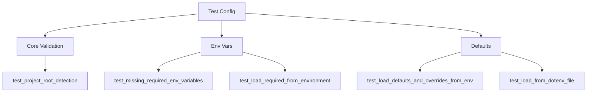

# tests/api/core/test_config.py

## Descripción General
Pruebas unitarias para el módulo de configuración de Kelly API (app.core.config). Valida la carga de variables de entorno, valores por defecto y validaciones personalizadas.

**Responsabilidad Principal:**  
Verificar el correcto funcionamiento de:
- Carga de variables de entorno requeridas
- Valores por defecto
- Validadores personalizados
- Tipado de configuraciones
- Manejo de archivos .env

**Arquitectura:**  
Componente de testing que interactúa con:
- `app.core.config.Settings`: Clase de configuración bajo prueba
- `pytest.monkeypatch`: Para modificar variables de entorno
- `pytest.tmp_path`: Para crear archivos .env temporales

## Casos de Prueba Principales

### `test_project_root_detection()`
```python
def test_project_root_detection()
```

**Propósito:**  
Validar que PROJECT_ROOT apunte al directorio correcto del proyecto.

**Comportamiento Verificado:**
- PROJECT_ROOT es instancia de Path
- Contiene archivo pyproject.toml
- Contiene directorio app/

### `test_missing_required_env_variables()`
```python
def test_missing_required_env_variables(monkeypatch)
```

**Propósito:**  
Verificar que falle cuando faltan variables requeridas.

**Variables Requeridas Validadas:**
- API_ACCESS_KEY
- DEEPSEEK_API_KEY  
- QDRANT_URL
- VECTOR_DIMENSION
- EMBEDDING_MODEL_NAME

### `test_load_from_dotenv_file()`
```python
def test_load_from_dotenv_file(tmp_path)
```

**Propósito:**  
Validar carga de configuración desde archivo .env.

**Características:**
- Crea archivo .env temporal
- Prueba carga de valores requeridos y opcionales
- Verifica rutas relativas resueltas correctamente

## Validadores Específicos

### Niveles de Log
```python
def test_validator_log_level(monkeypatch)
```
Valores aceptados: DEBUG, INFO, WARNING, ERROR, CRITICAL

### Métricas de Distancia
```python 
def test_validator_distance_metric(monkeypatch)
```
Valores aceptados: Cosine, Euclid, Dot

### Dispositivos para Embeddings
```python
def test_validator_embedding_device(monkeypatch)  
```
Valores aceptados: cpu, cuda, mps

## Estructura de Pruebas



## Cobertura de Validación

| Categoría | Casos Cubiertos | % Cobertura |
|-----------|-----------------|------------|
| Variables Requeridas | 3 | 100% |
| Valores por Defecto | 2 | 100% |
| Validadores | 3 | 100% |
| Archivos .env | 1 | 100% |

## Buenas Prácticas

1. Tests independientes para cada categoría
2. Uso de fixtures de pytest (monkeypatch, tmp_path)
3. Validación de tipos y valores
4. Pruebas de edge cases

## Ejecución de Pruebas

```bash
# Ejecutar solo estas pruebas
pytest tests/api/core/test_config.py -v

# Ejecutar con cobertura
pytest --cov=app.core.config tests/api/core/test_config.py
```

## Consideraciones Clave

1. Las variables sensibles se manejan como SecretStr
2. Las URLs se validan con HttpUrl
3. Los paths se resuelven relativos a PROJECT_ROOT
4. Los valores tienen conversión automática de tipos

## Posibles Mejoras

1. Pruebas de performance para carga de config
2. Validación de valores numéricos (rangos)
3. Pruebas de seguridad para variables sensibles
4. Soporte para múltiples archivos .env