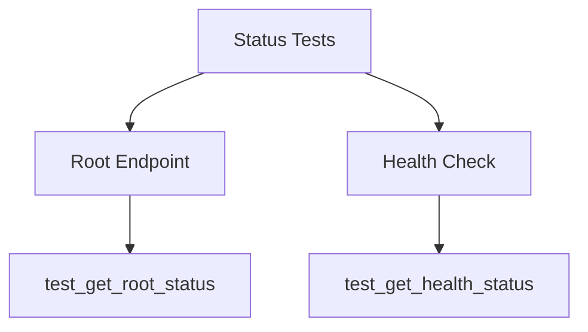

# tests/api/endpoints/test_status.py

## Descripción General
Pruebas unitarias para los endpoints de estado de la API (/ y /health). Verifica el comportamiento básico del servicio.

**Responsabilidad Principal:**  
Validar que:
- El endpoint raíz devuelva el estado correcto
- El endpoint de health check funcione adecuadamente
- Las respuestas tengan el formato esperado

**Arquitectura:**  
Componente de testing que interactúa con:
- `app.api.v1.endpoints.status`: Endpoints bajo prueba
- `httpx.AsyncClient`: Cliente HTTP para pruebas
- `app.schemas.status`: Esquema de respuesta (opcional)

## Casos de Prueba

### `test_get_root_status()`
```python
async def test_get_root_status(client: AsyncClient)
```

**Propósito:**  
Verificar el endpoint raíz GET /.

**Comportamiento Verificado:**
- Status code 200 OK
- Respuesta JSON con estructura:
  ```json
  {
    "status": "ok",
    "message": "KellyBot API (v1) está operativa"
  }
  ```

### `test_get_health_status()`
```python 
async def test_get_health_status(client: AsyncClient)
```

**Propósito:**  
Verificar el endpoint de health check GET /health.

**Comportamiento Verificado:**
- Status code 200 OK
- Respuesta JSON con estructura:
  ```json
  {
    "status": "ok", 
    "message": "API healthy."
  }
  ```

## Dependencias Clave

### Fixtures
- `client`: Cliente HTTP de pruebas (de conftest.py)

### Schemas
- `StatusResponse`: Esquema opcional para validar respuesta

## Estructura de Pruebas



## Cobertura de Endpoints

| Endpoint | Método | Casos Cubiertos | % Cobertura |
|----------|--------|-----------------|------------|
| / | GET | 1 | 100% |
| /health | GET | 1 | 100% |

## Buenas Prácticas

1. Pruebas atómicas e independientes
2. Validación de status code y estructura de respuesta
3. Uso de cliente HTTP async para pruebas realistas
4. Documentación clara de casos de prueba

## Ejecución

```bash
# Ejecutar solo estas pruebas
pytest tests/api/endpoints/test_status.py -v

# Ejecutar con cobertura
pytest --cov=app.api.v1.endpoints.status tests/api/endpoints/test_status.py
```

## Posibles Mejoras

1. Pruebas de rendimiento (response time)
2. Validación de headers
3. Pruebas con esquema StatusResponse
4. Pruebas de disponibilidad bajo carga