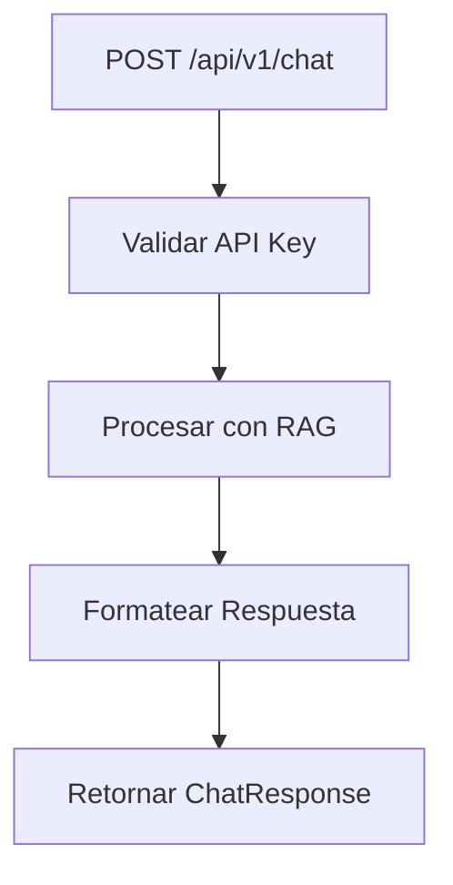

# app/api/v1/endpoints/chat.py

## Descripción General
Endpoint principal para el procesamiento de mensajes de chat utilizando el pipeline RAG (Retrieval-Augmented Generation). Proporciona:

- Interfaz REST para el servicio de chat
- Integración con el pipeline RAG
- Manejo de sesiones de conversación
- Retorno de fuentes/documentos relevantes

## Diagrama de Flujo


## Endpoint Principal

### POST /chat
```python
@router.post(
    "/chat",
    response_model=ChatResponse,
    summary="Procesar un mensaje de chat",
    description="Recibe mensaje y session_id, ejecuta pipeline RAG y devuelve respuesta + fuentes.",
    tags=["Chat"]
)
async def handle_chat_message(
    request: ChatRequest,
    api_key: str = Depends(get_api_key)
) -> ChatResponse:
```

#### Parámetros
- **request**: ChatRequest
  - message: str - Texto del mensaje del usuario
  - session_id: str - Identificador de sesión
- **api_key**: str - Clave de API (autenticación)

#### Respuesta
- **ChatResponse**:
  - answer: str - Respuesta generada
  - sources: List[SourceInfo] - Fuentes/documentos relevantes
  - session_id: str - Echo del session_id recibido

#### Flujo de Procesamiento
1. Validación de autenticación (API Key)
2. Llamada al pipeline RAG
3. Formateo de fuentes/documentos
4. Construcción de respuesta final
5. Manejo de errores y logging

## Dependencias Clave

### Internas
- `app.services.rag_pipeline`: Pipeline RAG principal
- `app.schemas.chat`: Modelos Pydantic (ChatRequest, ChatResponse, SourceInfo)
- `app.api.deps`: Utilidades de autenticación

### Externas
- `fastapi.APIRouter`: Sistema de routing
- `fastapi.HTTPException`: Manejo de errores HTTP
- `logging`: Sistema de registro

## Manejo de Errores
| Código | Escenario | Acción |
|--------|-----------|--------|
| 500 | Servicio RAG no disponible | Log crítico + respuesta de error |
| 500 | Respuesta RAG inválida | Log error + respuesta genérica |
| 500 | Error inesperado | Log exception + respuesta genérica |

## Ejemplo de Uso
```python
# Request
{
    "message": "¿Qué es RAG?",
    "session_id": "user123-session456"
}

# Response
{
    "answer": "RAG (Retrieval-Augmented Generation)...",
    "sources": [
        {"title": "Documentación RAG", "url": "...", "content": "..."}
    ],
    "session_id": "user123-session456"
}
```

## Consideraciones para Desarrolladores

### Para Modificar el Endpoint
1. Actualizar modelos en `app/schemas/chat.py` si cambia la estructura
2. Modificar llamada a RAG en caso de cambios en el servicio
3. Mantener compatibilidad con versiones anteriores

### Pruebas
- Verificar archivos relacionados en `tests/api/endpoints/test_chat.py`
- Probar escenarios:
  - Mensajes válidos/inválidos
  - Sesiones nuevas/existentes
  - Fallos del servicio RAG

### Seguridad
- Todas las llamadas requieren API Key válida
- Logging detallado sin exponer datos sensibles
- Validación estricta de inputs/outputs