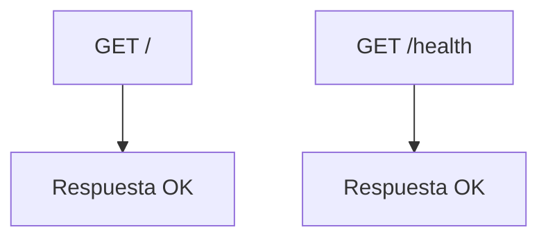

# app/api/v1/endpoints/status.py

## Descripción General
Endpoints para verificar el estado y salud de la API KellyBot. Proporciona:

- Verificación básica de disponibilidad
- Endpoint para monitoreo de salud
- Respuestas estandarizadas
- Logging de actividad

## Diagrama de Flujo


## Endpoints Principales

### GET /
```python
@router.get(
    "/",
    response_model=StatusResponse,
    summary="Verificar Estado General de la API",
    description="Endpoint simple para verificar que la API está en línea y respondiendo.",
    tags=["Status"]
)
async def get_root_status():
```

#### Respuesta
- **StatusResponse**:
  - status: str - "ok" o "error"
  - message: str - Mensaje descriptivo

#### Propósito
- Verificación básica de disponibilidad
- Punto de entrada principal

### GET /health
```python
@router.get(
    "/health",
    response_model=StatusResponse,
    summary="Verificar Salud de la API",
    description="Endpoint de verificación de salud para monitoreo.",
    tags=["Status"],
    include_in_schema=False
)
async def get_health_status():
```

#### Características Especiales
- Oculto de la documentación pública (include_in_schema=False)
- Uso principal para sistemas de monitoreo
- Respuesta rápida sin dependencias externas

## Dependencias Clave

### Internas
- `app.schemas.status`: Modelo StatusResponse
- `logging`: Sistema de registro

### Externas
- `fastapi.APIRouter`: Sistema de routing
- `fastapi.HTTPException`: Manejo de errores

## Estructura de Respuesta
```python
class StatusResponse:
    def __init__(self, status: str, message: str):
        self.status = status  # "ok" o "error"
        self.message = message  # Mensaje descriptivo
```

## Consideraciones para Desarrolladores

### Para Modificar
1. Actualizar `StatusResponse` en app/schemas/status.py si cambia la estructura
2. Añadir chequeos adicionales en /health para:
   - Conexión a bases de datos
   - Servicios externos
   - Uso de recursos

### Monitoreo
- Configurar alertas basadas en respuestas HTTP
- Intervalo recomendado: 60 segundos
- Umbral de error: 3 fallos consecutivos

### Pruebas
- Verificar archivos relacionados en `tests/api/endpoints/test_status.py`
- Probar escenarios:
  - API disponible
  - API bajo carga
  - Fallos de dependencias

### Seguridad
- No requiere autenticación
- No expone información sensible
- Logging mínimo (solo registro de acceso)