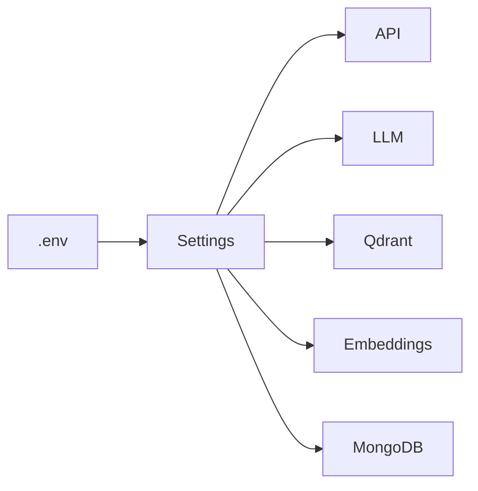

# app/core/config.py

## Descripción General
Configuración centralizada para la API KellyBot usando Pydantic Settings. Maneja:

- Carga de variables de entorno
- Validación de configuraciones
- Resolución de rutas relativas
- Tipado estricto de valores

## Diagrama de Configuración


## Clase Principal: Settings

### Configuración Básica
```python
class Settings(BaseSettings):
    """Carga y valida las configuraciones para la API KellyBot."""
```

#### Herencia
- `BaseSettings` (de pydantic-settings)

#### Configuración del Modelo
```python
model_config = SettingsConfigDict(
    env_file=PROJECT_ROOT / '.env',
    env_file_encoding='utf-8',
    extra='ignore',
    case_sensitive=False
)
```

## Secciones de Configuración

### 1. API Server
| Parámetro | Tipo | Descripción |
|-----------|------|-------------|
| API_HOST | str | Host para el servidor API |
| API_PORT | int | Puerto para el servidor API |
| LOG_LEVEL | LogLevel | Nivel de logging |
| API_ACCESS_KEY | SecretStr | Clave de acceso para la API |

### 2. LLM (Deepseek)
| Parámetro | Tipo | Descripción |
|-----------|------|-------------|
| DEEPSEEK_API_KEY | SecretStr | API Key para Deepseek |
| DEEPSEEK_BASE_URL | HttpUrl | URL base de la API |
| LLM_REQUEST_TIMEOUT | float | Timeout para requests |

### 3. Qdrant
| Parámetro | Tipo | Descripción |
|-----------|------|-------------|
| QDRANT_URL | HttpUrl | URL del servidor Qdrant |
| QDRANT_COLLECTION_NAME | str | Nombre de la colección |
| DISTANCE_METRIC | QdrantDistance | Métrica de distancia |

### 4. Embeddings
| Parámetro | Tipo | Descripción |
|-----------|------|-------------|
| EMBEDDING_MODEL_NAME | str | Nombre del modelo |
| EMBEDDING_DEVICE | EmbeddingDevice | Dispositivo para embeddings |

## Validadores Clave

### validate_resolve_path
```python
@field_validator('API_LOG_FILE', 'PRIORITY_CONTEXT_FILE_PATH')
def validate_resolve_path(cls, value: Any) -> Optional[Path]
```
- Convierte rutas relativas a absolutas
- Resuelve respecto a PROJECT_ROOT

### check_overlap_less_than_size
```python
@model_validator(mode='after')
def check_overlap_less_than_size(self) -> 'Settings'
```
- Valida que CHUNK_OVERLAP < CHUNK_SIZE
- Previene configuraciones inválidas

## Instancia Global
```python
settings = Settings()  # Singleton de configuración
```

## Consideraciones para Desarrolladores

### Variables Requeridas
- API_ACCESS_KEY
- DEEPSEEK_API_KEY  
- QDRANT_URL
- EMBEDDING_MODEL_NAME

### Tipos Especiales
```python
QdrantDistance = Literal["Cosine", "Dot", "Euclid"]
EmbeddingDevice = Literal["auto", "cpu", "cuda"] 
LogLevel = Literal["DEBUG", "INFO", "WARNING", "ERROR", "CRITICAL"]
```

### Manejo de Errores
- ValidationError: Configuración inválida
- FileNotFoundError: Archivos de configuración faltantes