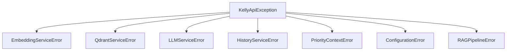

# app/core/exceptions.py

## Descripción General
Excepciones personalizadas para la aplicación Kelly API. Proporciona:

- Jerarquía estructurada de errores
- Códigos de estado HTTP específicos
- Mensajes descriptivos para cada tipo de error
- Manejo granular de fallos en servicios

## Diagrama de Jerarquía


## Excepción Base

### KellyApiException
```python
class KellyApiException(Exception):
    """Excepción base para errores específicos de la aplicación Kelly API."""
```

#### Parámetros
- `message`: str - Mensaje descriptivo del error
- `status_code`: int - Código HTTP sugerido (default: 500)

## Excepciones Específicas

### 1. Errores de Servicios

| Excepción | Código HTTP | Descripción |
|-----------|------------|-------------|
| `EmbeddingServiceError` | 500 | Fallos en generación/gestión de embeddings |
| `QdrantServiceError` | 503 | Problemas con el servicio Qdrant (vector DB) |
| `LLMServiceError` | 502 | Errores en el modelo generativo (LLM) |
| `HistoryServiceError` | 500 | Fallos en el historial de chat (MongoDB) |
| `PriorityContextError` | 500 | Problemas con el contexto prioritario |

### 2. Errores de Sistema

| Excepción | Código HTTP | Descripción |
|-----------|------------|-------------|
| `ConfigurationError` | 500 | Configuración inválida o faltante |
| `RAGPipelineError` | 500 | Fallos en el pipeline RAG |

## Buenas Prácticas

### Cuándo Usar Cada Excepción
1. **Servicios Externos**: Usar las excepciones específicas (QdrantServiceError, LLMServiceError)
2. **Configuración**: Usar ConfigurationError
3. **Lógica de Negocio**: Crear nuevas excepciones heredando de KellyApiException

### Manejo Recomendado
```python
try:
    # Llamada a servicio
except QdrantServiceError as e:
    logger.error(f"Error Qdrant: {e}")
    raise HTTPException(status_code=e.status_code, detail=e.message)
```

## Consideraciones para Desarrolladores

### Extensión
- Crear nuevas excepciones heredando de KellyApiException
- Especificar códigos HTTP apropiados

### Logging
- Registrar el tipo específico de excepción
- Incluir contexto relevante

### Pruebas
- Verificar que cada excepción mantenga su código HTTP
- Probar herencia y mensajes predeterminados