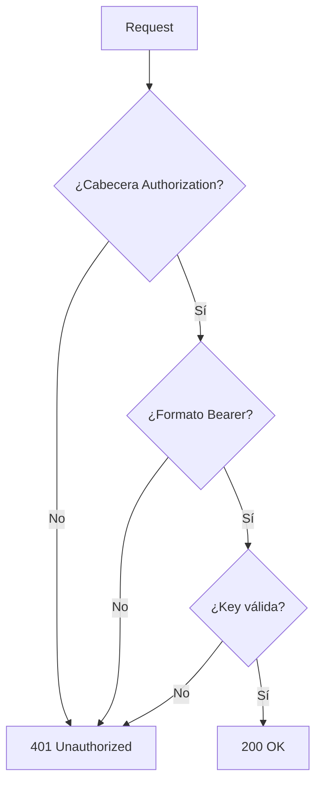

# app/core/security.py

## Descripción General
Módulo de seguridad para la API KellyBot que maneja:

- Validación de API Keys
- Esquemas de autenticación
- Manejo seguro de credenciales
- Generación de respuestas HTTP seguras

## Diagrama de Flujo


## Componentes Principales

### API_KEY_HEADER
```python
APIKeyHeader(name="Authorization", auto_error=False)
```
- **Propósito**: Esquema FastAPI para extraer API Keys
- **Cabecera**: `Authorization: Bearer <token>`
- **auto_error**: False (manejo manual de errores)

### Función verify_api_key
```python
async def verify_api_key(api_key_header: Optional[str]) -> str
```

#### Flujo de Validación
1. **Configuración del servidor**:
   - Verifica que API_ACCESS_KEY esté configurada
   - Error 500 si no está configurada

2. **Cabecera Authorization**:
   - Verifica presencia de cabecera
   - Error 401 si falta

3. **Formato Bearer**:
   - Valida formato `Bearer <token>`
   - Error 401 si formato incorrecto

4. **Comparación segura**:
   - Usa `secrets.compare_digest` para evitar timing attacks
   - Error 401 si key no coincide

## Dependencias Clave

### Internas
- `app.core.config.settings`: Para obtener API_ACCESS_KEY
- `fastapi.security.APIKeyHeader`: Esquema de seguridad

### Externas
- `secrets`: Para comparación segura de strings
- `fastapi.HTTPException`: Para respuestas de error

## Códigos de Error

| Código | Situación | Detalle |
|--------|-----------|---------|
| 401 | Falta cabecera/formato inválido/key incorrecta | Incluye cabecera WWW-Authenticate |
| 500 | Configuración incorrecta | Error interno del servidor |

## Buenas Prácticas

### Seguridad
- **Comparación segura**: Evita timing attacks con `secrets.compare_digest`
- **Manejo de errores**: No revela detalles internos en respuestas
- **Logging**: Registra intentos fallidos sin exponer credenciales

### Integración
- **FastAPI**: Usado como dependencia en endpoints
- **Configuración**: Centralizada en settings.py

## Consideraciones para Desarrolladores

### Pruebas
- Verificar todos los flujos de error
- Probar con y sin configuración
- Validar respuestas HTTP

### Extensión
- Añadir nuevos esquemas de seguridad
- Implementar OAuth2 si es necesario
- Soporte para múltiples API Keys