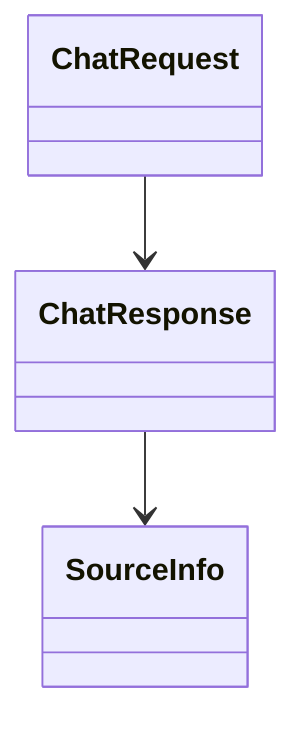

# app/schemas/chat.py

## Descripción General
Módulo que define los esquemas Pydantic para:

- Validación de peticiones al endpoint `/chat`
- Estructura de respuestas del asistente
- Modelado de fuentes de conocimiento

## Diagrama de Relaciones


## Esquemas Principales

### ChatRequest
```python
class ChatRequest(BaseModel)
```
Modelo para peticiones al endpoint de chat.

**Campos:**
- `message`: str (requerido, 1-5000 chars)
  - Mensaje/pregunta del usuario
- `session_id`: str (requerido)
  - Identificador de sesión/usuario

**Ejemplo JSON:**
```json
{
  "message": "¿Cómo configurar mi correo?",
  "session_id": "user123-abc"
}
```

### SourceInfo
```python
class SourceInfo(BaseModel)
```
Metadatos de fuentes consultadas para generar la respuesta.

**Campos:**
- `source_id`: str (requerido)
  - Identificador único de la fuente
- `score`: Optional[float]
  - Relevancia según base vectorial

**Ejemplo JSON:**
```json
{
  "source_id": "CONFIG-EMAIL-01_q0",
  "score": 0.9123
}
```

### ChatResponse
```python
class ChatResponse(BaseModel)
```
Estructura de respuesta del endpoint de chat.

**Campos:**
- `answer`: str (requerido)
  - Respuesta generada
- `sources`: List[SourceInfo]
  - Fuentes consultadas
- `session_id`: str (requerido)
  - ID de sesión original

**Ejemplo JSON:**
```json
{
  "answer": "Para configurar tu correo...",
  "sources": [
    {"source_id": "CONFIG-EMAIL-01_q0", "score": 0.9123}
  ],
  "session_id": "user123-abc"
}
```

## Validaciones y Configuraciones

### Restricciones
- Longitud de mensaje: 1-5000 caracteres
- Campos requeridos marcados con `...`
- Tipado estricto con Pydantic

### Configuraciones Adicionales
- Ejemplos embebidos en `model_config`
- Soporte para documentación OpenAPI

## Dependencias
- `pydantic.BaseModel`: Base para esquemas
- `typing`: Para tipos opcionales/listas

## Flujo de Trabajo
1. Cliente envía `ChatRequest`
2. Servidor procesa y genera `ChatResponse`
3. Se incluyen `SourceInfo` de fuentes consultadas

## Consideraciones para Desarrolladores

### Extensión
- Añadir campos adicionales a `ChatRequest.context_override`
- Incluir más metadatos en `SourceInfo`

### Pruebas
- Validar esquemas con casos límite
- Verificar serialización/deserialización