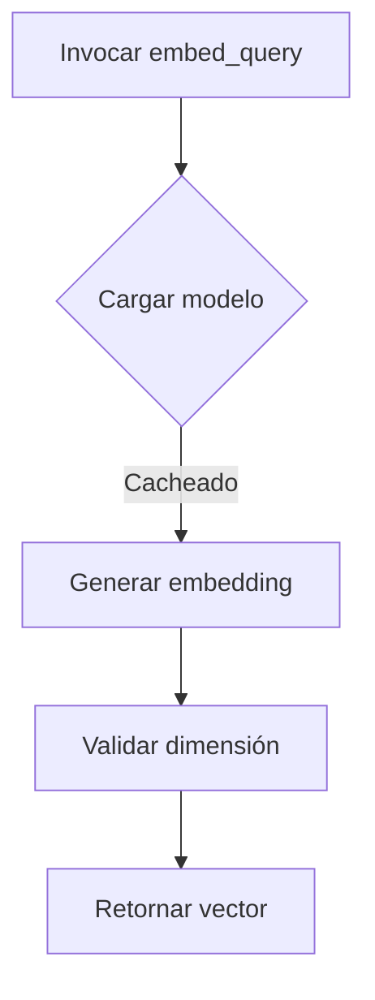

# app/services/embedding_service.py

## Descripción General
Servicio para generación de embeddings vectoriales usando modelos SentenceTransformer. Proporciona:

- Carga eficiente de modelos con caché
- Soporte para CPU/GPU (CUDA)
- Generación asíncrona de embeddings
- Validación de dimensiones vectoriales

## Diagrama de Flujo


## Componentes Principales

### Función get_embedding_model
```python
@lru_cache(maxsize=1)
def get_embedding_model() -> Optional[SentenceTransformer]
```
Carga y cachea el modelo de embeddings configurado.

**Características:**
- Selección automática de dispositivo (CPU/GPU)
- Validación de dimensiones
- Manejo robusto de errores

**Dependencias:**
- `settings.EMBEDDING_MODEL_NAME`
- `settings.EMBEDDING_DEVICE`
- `settings.VECTOR_DIMENSION`

### Función embed_query
```python
async def embed_query(query: str) -> List[float]
```
Genera embeddings vectoriales para textos de forma asíncrona.

**Parámetros:**
- `query`: Texto a procesar (1-5000 caracteres)

**Proceso:**
1. Valida la entrada
2. Obtiene modelo cacheado
3. Ejecuta encoding en thread separado
4. Convierte resultado a lista de floats

**Ejemplo de Uso:**
```python
vector = await embed_query("Texto de ejemplo")
```

## Configuración

### Variables Requeridas
- `EMBEDDING_MODEL_NAME`: Nombre del modelo (ej: "all-MiniLM-L6-v2")
- `EMBEDDING_DEVICE`: Dispositivo ("cpu", "cuda" o "auto")
- `VECTOR_DIMENSION`: Dimensión esperada (ej: 384)

### Manejo de Errores
- Registra errores detallados
- Provee fallbacks para dependencias faltantes
- Valida dimensiones de embeddings

## Dependencias Clave
- `sentence-transformers`: Modelos de embeddings
- `numpy`: Manipulación de vectores
- `torch`: Soporte para GPU

## Consideraciones

### Rendimiento
- Uso eficiente de GPU cuando disponible
- Caché de modelo para múltiples llamadas
- Ejecución no-bloqueante con asyncio

### Extensión
- Soporte para batch processing
- Adición de metadatos a embeddings
- Plugins para modelos alternativos

### Pruebas
- Validar diferentes longitudes de texto
- Verificar comportamiento sin GPU
- Probar con modelos de distintas dimensiones