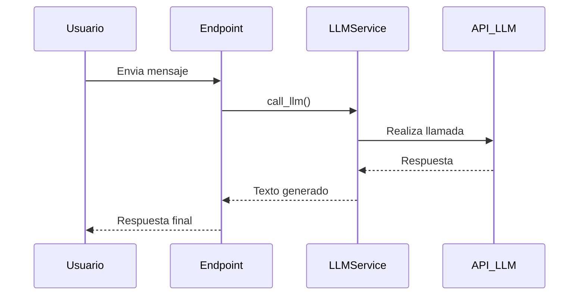

# app/services/llm_service.py

## Descripción General
Servicio principal para interactuar con modelos de lenguaje (LLM) como DeepSeek. Proporciona:

- Conexión segura y configurable a APIs de LLM
- Gestión de errores robusta
- Interfaz asíncrona no bloqueante
- Cache de conexiones

**Responsabilidad Principal:**  
Servir como puente entre la aplicación y los servicios externos de modelos de lenguaje.

**Arquitectura:**  
Componente clave en la capa de servicios que interactúa con:
- Configuración central (para credenciales y parámetros)
- Endpoints de chat (para procesar solicitudes)
- Sistema de logging (para monitoreo)

## Componentes Principales

### Función `_get_llm_client() -> Optional[OpenAIClient]`
```python
@lru_cache(maxsize=1)
def _get_llm_client() -> Optional[OpenAIClient]
```
Inicializa y cachea el cliente LLM usando el patrón Singleton.

**Configuración Requerida:**
- `DEEPSEEK_API_KEY`: Credencial de autenticación
- `DEEPSEEK_BASE_URL`: Endpoint de la API
- `LLM_REQUEST_TIMEOUT`: Tiempo máximo de espera

**Manejo de Errores:**
- Verifica disponibilidad de dependencias
- Valida configuración mínima
- Registra fallos detallados

### Función `call_llm(messages: List[Dict[str, str]], temperature: float = 0.5, max_tokens: int = 1500) -> Optional[str]`
```python
async def call_llm(messages, temperature=0.5, max_tokens=1500)
```
Realiza llamadas asíncronas al LLM configurado.

**Parámetros:**
- `messages`: Historial de conversación en formato OpenAI
- `temperature`: Control de creatividad (0-1)
- `max_tokens`: Límite de tokens generados

**Flujo de Trabajo:**
1. Obtiene cliente cacheado
2. Valida entrada
3. Realiza llamada API
4. Procesa respuesta
5. Maneja errores específicos

**Retorno:**
- Texto generado (str) en éxito
- None en caso de error

## Dependencias Clave

### Internas
- `app.core.config`: Para parámetros de conexión
- Sistema de logging: Para monitoreo

### Externas
- `openai`: Cliente oficial para APIs OpenAI/DeepSeek
- `asyncio`: Para operaciones asíncronas

## Configuración Requerida

| Variable | Descripción | Ejemplo |
|----------|-------------|---------|
| DEEPSEEK_API_KEY | API Key secreta | `sk-...` |
| DEEPSEEK_BASE_URL | URL base API | `https://api.deepseek.com/` |
| DEEPSEEK_MODEL_NAME | Modelo a usar | `deepseek-chat` |
| LLM_REQUEST_TIMEOUT | Timeout en segundos | `120.0` |

## Diagrama de Secuencia


## Consideraciones Técnicas

### Patrones de Diseño
- **Singleton:** Cliente cacheado con LRU
- **Async/Await:** Para operaciones no bloqueantes
- **Circuit Breaker:** Manejo robusto de errores

### Seguridad
- Manejo seguro de credenciales
- Validación estricta de entradas
- Logging sin datos sensibles

### Rendimiento
- Conexiones persistentes
- Timeout configurable
- Cache de cliente

## Archivos Relacionados
- `tests/api/endpoints/test_chat.py`: Pruebas de integración
- `app/api/v1/endpoints/chat.py`: Consumidor principal
- `app/core/config.py`: Configuración de conexión