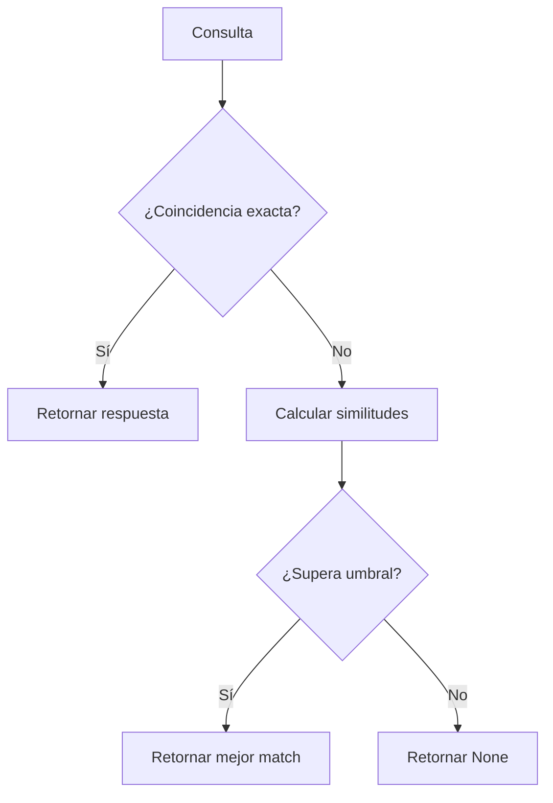

# app/services/priority_context_service.py

## Descripción General
Servicio para manejar respuestas prioritarias predefinidas en formato FAQ. Proporciona:

- Carga y cache de FAQs desde JSON
- Búsqueda exacta y por similitud
- Integración con el pipeline RAG principal
- Manejo robusto de errores

**Responsabilidad Principal:**  
Proveer respuestas inmediatas para preguntas frecuentes sin necesidad de consultar el modelo LLM.

**Arquitectura:**  
Componente de pre-filtrado que interactúa con:
- Configuración central (para rutas de archivos)
- Pipeline RAG (para bypassear búsquedas innecesarias)
- Sistema de logging (para monitoreo)

## Componentes Principales

### Función `_load_priority_data() -> List[Dict[str, Any]]`
```python
@lru_cache(maxsize=1)
def _load_priority_data()
```
Carga y cachea los datos de FAQs desde archivo JSON.

**Configuración Requerida:**
- `priority_context_file_path`: Ruta al archivo JSON
- `PRIORITY_SIMILARITY_THRESHOLD`: Umbral de similitud (0-1)

**Procesamiento:**
1. Valida estructura del archivo
2. Filtra entradas inválidas
3. Preprocesa textos (lowercase, trim)
4. Cachea resultados

### Función `find_priority_answer(query: str) -> Optional[str]`
```python
async def find_priority_answer(query)
```
Busca respuestas prioritarias para una consulta.

**Algoritmo de Búsqueda:**
1. Coincidencia exacta (case-insensitive)
2. Búsqueda por similitud (difflib)
3. Aplicación de umbral configurable

**Parámetros:**
- `query`: Texto de búsqueda

**Retorno:**
- Respuesta (str) si supera umbral
- None si no hay coincidencia

## Diagrama de Flujo


## Dependencias Clave

### Internas
- `app.core.config`: Para parámetros de configuración
- `app.core.exceptions`: Para errores personalizados

### Externas
- `difflib`: Para cálculo de similitud
- `json`: Para parseo de archivos

## Configuración Requerida

| Variable | Descripción | Ejemplo |
|----------|-------------|---------|
| priority_context_file_path | Ruta al JSON | `data/priority_context.json` |
| PRIORITY_SIMILARITY_THRESHOLD | Umbral de similitud | `0.85` |

## Consideraciones Técnicas

### Rendimiento
- Cache LRU para datos de FAQs
- Preprocesamiento de textos
- Búsqueda optimizada

### Seguridad
- Validación de estructura JSON
- Manejo de permisos
- Logging sin datos sensibles

### Mantenimiento
- Formato estándar para FAQs
- Umbral configurable
- Detección de entradas inválidas

## Archivos Relacionados
- `data/priority_context.json`: Fuente de datos
- `tests/api/endpoints/test_chat.py`: Pruebas de integración
- `app/services/rag_pipeline.py`: Consumidor principal