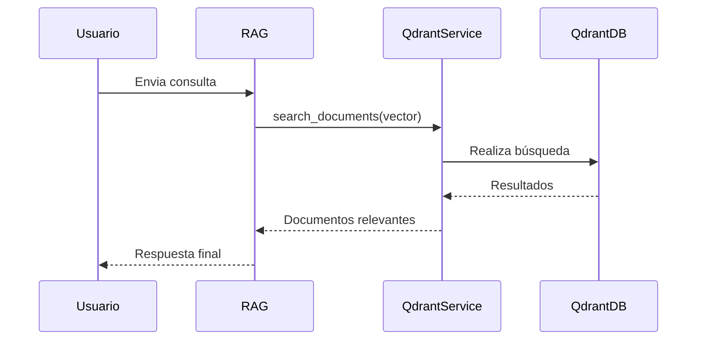

# app/services/qdrant_service.py

## Descripción General
Servicio para interactuar con la base de datos vectorial Qdrant. Proporciona:

- Conexión asíncrona a Qdrant
- Búsqueda de embeddings similares
- Manejo robusto de errores
- Integración con el pipeline RAG

**Responsabilidad Principal:**  
Realizar búsquedas semánticas en la base de datos vectorial.

**Arquitectura:**  
Componente clave en la capa de servicios que interactúa con:
- Configuración central (para credenciales)
- Servicio de embeddings (para vectores de entrada)
- Pipeline RAG (para procesar resultados)

## Componentes Principales

### Función `_get_qdrant_client() -> Optional[AsyncQdrantClient]`
```python
@lru_cache(maxsize=1)
def _get_qdrant_client()
```
Inicializa y cachea el cliente Qdrant usando patrón Singleton.

**Configuración Requerida:**
- `QDRANT_URL`: Endpoint del servidor
- `QDRANT_API_KEY`: Credencial opcional
- `QDRANT_COLLECTION_NAME`: Colección objetivo

**Manejo de Errores:**
- Verifica disponibilidad de librería
- Valida configuración mínima
- Registra fallos detallados

### Función `search_documents(vector: List[float], top_k: Optional[int] = None, query_filter: Optional[models.Filter] = None) -> List[Dict[str, Any]]`
```python
async def search_documents(vector, top_k=None, query_filter=None)
```
Busca documentos similares a un vector dado.

**Flujo de Trabajo:**
1. Obtiene cliente cacheado
2. Valida vector de entrada
3. Realiza búsqueda semántica
4. Procesa y formatea resultados

**Parámetros:**
- `vector`: Embedding de la consulta
- `top_k`: Máximo de resultados (default: RAG_TOP_K)
- `query_filter`: Filtros opcionales

**Retorno:**
- Lista de documentos con metadatos
- Lista vacía en caso de error

## Diagrama de Secuencia


## Dependencias Clave

### Internas
- `app.core.config`: Para parámetros de conexión
- Sistema de logging: Para monitoreo

### Externas
- `qdrant-client`: Cliente oficial para Qdrant
- `numpy`: Para manejo de vectores (en pruebas)

## Configuración Requerida

| Variable | Descripción | Ejemplo |
|----------|-------------|---------|
| QDRANT_URL | URL del servidor | `http://localhost:6333` |
| QDRANT_API_KEY | API Key (opcional) | `secret-key` |
| QDRANT_COLLECTION_NAME | Colección objetivo | `documentos` |
| RAG_TOP_K | Resultados por defecto | `3` |

## Consideraciones Técnicas

### Rendimiento
- Cliente cacheado con LRU
- Conexiones persistentes
- Búsquedas asíncronas

### Seguridad
- Manejo seguro de credenciales
- Validación estricta de entradas
- Logging sin datos sensibles

### Mantenimiento
- Tipado estricto
- Manejo detallado de errores
- Documentación de parámetros

## Archivos Relacionados
- `app/services/rag_pipeline.py`: Consumidor principal
- `app/core/config.py`: Configuración de conexión
- `tests/api/endpoints/test_chat.py`: Pruebas de integración