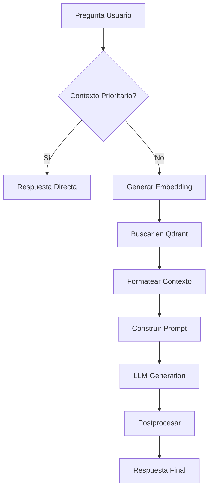

# app/services/rag_pipeline.py

## Descripción General
Pipeline completo de Retrieval-Augmented Generation (RAG) que integra:

- Contexto prioritario
- Historial de conversación  
- Búsqueda semántica en Qdrant
- Generación con LLM
- Postprocesado de respuestas

**Responsabilidad Principal:**  
Generar respuestas contextualizadas y personalizadas para el asistente virtual Kely.

**Arquitectura:**  
Componente central que coordina múltiples servicios:
- `priority_context_service`: Respuestas predefinidas
- `history_service`: Contexto conversacional
- `qdrant_service`: Búsqueda documental  
- `llm_service`: Generación de lenguaje natural

## Diagrama de Flujo


## Componentes Principales

### Función `generate_response(question: str, session_id: str) -> Dict[str, Any]`
```python
async def generate_response(question, session_id)
```
Orquesta todo el pipeline RAG.

**Flujo:**
1. Verifica contexto prioritario
2. Recupera historial conversacional
3. Genera embedding de la pregunta
4. Busca documentos relevantes en Qdrant
5. Construye prompt contextualizado
6. Genera respuesta con LLM
7. Aplica postprocesado
8. Guarda en historial

**Parámetros:**
- `question`: Consulta del usuario
- `session_id`: Identificador de conversación

**Retorno:**
```typescript
{
  answer: string, // Respuesta procesada
  sources: SourceInfo[] // Fuentes utilizadas
}
```

### Funciones Auxiliares

#### `_format_context_from_qdrant()`
Formatea resultados de Qdrant para el prompt:
- Filtra duplicados
- Controla longitud máxima
- Extrae metadatos de fuentes

#### `_format_history_for_prompt()`
Prepara el historial conversacional:
- Conserva últimos N mensajes
- Formatea para inclusión en prompt

#### `_post_process_llm_answer()`
Limpia respuestas del LLM:
- Elimina markdown no deseado
- Filtra frases prohibidas
- Normaliza espacios y saltos

## Configuración

| Variable | Descripción | Valor Default |
|----------|-------------|---------------|
| RAG_TOP_K | Resultados a recuperar | 3 |
| RAG_MAX_CONTEXT_TOKENS | Límite de contexto | 3000 |
| RAG_HISTORY_MESSAGES | Mensajes a conservar | 6 |

## Plantilla de Prompt
```text
Eres Kely, la asistente virtual de Computo Contable Soft...

{history_section}
Contexto Recuperado:
---
{context}
---

Pregunta: {question}
```

**Directrices clave:**
- Estilo cálido pero profesional
- Evitar jerga técnica innecesaria  
- Basarse estrictamente en el contexto
- Redirigir a soporte cuando sea necesario

## Manejo de Errores

**Escenarios:**
1. Servicios no disponibles → Mensaje genérico
2. Sin contexto relevante → Redirigir a soporte
3. Error en LLM → Respuesta de contingencia

**Mensajes predefinidos:**
```python
DEFAULT_ERROR_MESSAGE = "Estoy teniendo dificultades..."
NO_CONTEXT_ANSWER = "Para más detalles, contacta a soporte..."
```

## Consideraciones Técnicas

### Rendimiento
- Operaciones asíncronas
- Control de longitud de contexto
- Cacheo de embeddings

### Seguridad  
- Validación de entradas
- Filtrado de contenido
- Logging sin datos sensibles

### Mantenimiento
- Tipado estricto
- Manejo modular de errores
- Configuración centralizada

## Dependencias Clave

### Internas
- Todos los servicios del módulo `app/services`
- Configuración central (`app.core.config`)
- Esquemas de datos (`app.schemas`)

### Externas
- `qdrant-client`: Cliente vectorial
- `langchain-core`: Manejo de historial
- Modelo de embeddings

## Archivos Relacionados
- `tests/api/endpoints/test_chat.py`: Pruebas de integración
- `app/api/v1/endpoints/chat.py`: Punto de entrada API
- `app/services/qdrant_service.py`: Búsqueda semántica