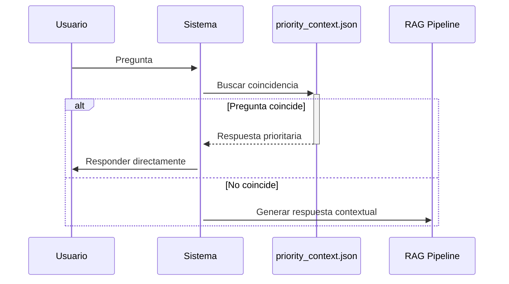

# data/priority_context.json

## Descripción General
Archivo JSON que contiene respuestas prioritarias predefinidas para el asistente virtual Kely. Estas respuestas tienen prioridad sobre las generadas por el pipeline RAG cuando coinciden con la consulta del usuario.

**Responsabilidad Principal:**  
Proveer respuestas inmediatas y consistentes para preguntas frecuentes (FAQs) sobre los productos MiAdminXML y MiExpedienteContable.

**Arquitectura:**  
Componente clave del sistema de contexto prioritario que interactúa con:
- `priority_context_service`: Busca y recupera respuestas
- `generate_response()`: Función principal del pipeline RAG

## Estructura del Archivo

```json
{
  "faqs": [
    {
      "q": "Pregunta frecuente",
      "a": "Respuesta prioritaria", 
      "keywords": ["palabras", "clave"]
    }
  ]
}
```

### Campos por Entrada FAQ:
| Campo | Tipo | Descripción | Ejemplo |
|-------|------|-------------|---------|
| `q` | string | Pregunta completa | "¿Cómo activo MiAdminXML?" |
| `a` | string | Respuesta prioritaria | "Tras instalarlo, ve a la sección de licenciamiento..." |
| `keywords` | array[string] | Términos relacionados para matching | ["activar", "licencia", "key"] |

## Categorías de Preguntas

### 1. Saludos y Básicos
- Saludos iniciales
- Presentación del asistente
- Agradecimientos

### 2. Contacto y Soporte  
- Información de contacto
- Horarios de atención
- Solicitud de soporte humano

### 3. MiAdminXML
- Definición y funcionalidad
- Requisitos del sistema  
- Licenciamiento y precios
- Proceso de instalación

### 4. MiExpedienteContable
- Definición y alcance
- Características principales
- Opciones de licencia

### 5. Licenciamiento General
- Restricciones de uso
- Procesos de pago
- Políticas de activación

## Ejemplo de Entrada Completa

```json
{
  "q": "¿Cuánto cuesta la licencia MiAdminXML Plus?",
  "a": "La Licencia Plus tiene un costo de $1,449 MXN por año (IVA incluido).",
  "keywords": ["precio", "costo", "valor", "miadminxml", "licencia", "plus"]
}
```

## Flujo de Uso



## Consideraciones Clave

### Mantenimiento
- **Actualizaciones:** Modificar directamente el JSON
- **Nuevas FAQs:** Añadir entradas completas con preguntas, respuestas y keywords relevantes
- **Pruebas:** Verificar matching con variedad de formulaciones

### Rendimiento
- Carga en memoria al iniciar el servicio
- Búsqueda por coincidencia exacta o keywords
- Optimizado para lectura rápida

### Seguridad
- Validar contenido de respuestas
- Escapar caracteres especiales
- No incluir datos sensibles

## Dependencias
- **Servicio:** `priority_context_service.py`
- **Pipeline:** `rag_pipeline.py`
- **Tests:** `test_priority_context.py`

## Mejoras Futuras
1. Soporte para múltiples idiomas
2. Sistema de versionado de FAQs
3. Métricas de uso por pregunta