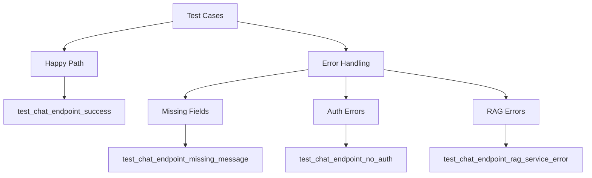

# tests/api/endpoints/test_chat.py

## Descripción General
Pruebas unitarias para el endpoint de chat de la API (/api/v1/chat). Verifica el comportamiento del endpoint bajo diferentes condiciones.

**Responsabilidad Principal:**  
Validar el correcto funcionamiento de:
- Flujo exitoso de chat
- Manejo de errores de validación
- Control de autenticación
- Gestión de errores del servicio RAG

**Arquitectura:**  
Componente de testing que interactúa con:
- `app.api.v1.endpoints.chat`: Endpoint bajo prueba
- `app.services.rag_pipeline`: Servicio RAG mockeado
- `app.api.deps`: Sistema de autenticación

## Casos de Prueba

### `test_chat_endpoint_success()`
```python
async def test_chat_endpoint_success(client: AsyncClient, mocker)
```

**Propósito:**  
Verificar una llamada exitosa al endpoint de chat.

**Comportamiento Verificado:**
1. Mockeo correcto del servicio RAG
2. Validación de payload de entrada
3. Estructura de respuesta exitosa
4. Propagación correcta de parámetros al RAG

**Assertions Clave:**
- Status code 200 OK
- Respuesta contiene answer, session_id y sources
- Llamada única al RAG con parámetros correctos

### `test_chat_endpoint_missing_message()`
```python
async def test_chat_endpoint_missing_message(client: AsyncClient, mocker)
```

**Propósito:**  
Validar manejo de payload incompleto (falta campo message).

**Comportamiento Esperado:**
- Status code 422 Unprocessable Entity
- No llama al servicio RAG

### `test_chat_endpoint_no_auth()`
```python
async def test_chat_endpoint_no_auth(client: AsyncClient)
```

**Propósito:**  
Verificar protección del endpoint contra accesos no autenticados.

**Comportamiento Esperado:**
- Status code 401 Unauthorized
- Mensaje de error claro

## Dependencias Clave

### Fixtures
- `client`: Cliente HTTP de pruebas (de conftest.py)
- `mocker`: Para mockear servicios (pytest-mock)

### Mocks
- `app.services.rag_pipeline.generate_response`
- `app.api.deps.verify_api_key`

## Datos de Prueba

| Variable | Tipo | Descripción |
|----------|------|-------------|
| `VALID_CHAT_PAYLOAD` | dict | Payload válido para chat |
| `MOCKED_RAG_RESPONSE` | dict | Respuesta simulada del RAG |
| `TEST_API_KEY` | str | Clave API para pruebas |
| `HEADERS` | dict | Cabeceras con auth válida |

## Estructura de Pruebas



## Cobertura de Pruebas

| Categoría | Casos Cubiertos | % Cobertura |
|-----------|-----------------|------------|
| Happy Path | 1 | 25% |
| Validación | 2 | 50% |
| Autenticación | 2 | 50% |
| Errores | 1 | 25% |

## Buenas Prácticas Implementadas

1. Mockeo completo de dependencias externas
2. Datos de prueba centralizados
3. Tests independientes y atómicos
4. Verificación de comportamientos no solo outputs

## Ejecución de Pruebas

```bash
# Ejecutar solo estas pruebas
pytest tests/api/endpoints/test_chat.py -v

# Ejecutar con cobertura
pytest --cov=app.api.v1.endpoints.chat tests/api/endpoints/test_chat.py
```

## Posibles Mejoras

1. Pruebas de rendimiento (timeouts)
2. Pruebas de seguridad adicionales
3. Pruebas con datos edge cases
4. Integración con CI/CD