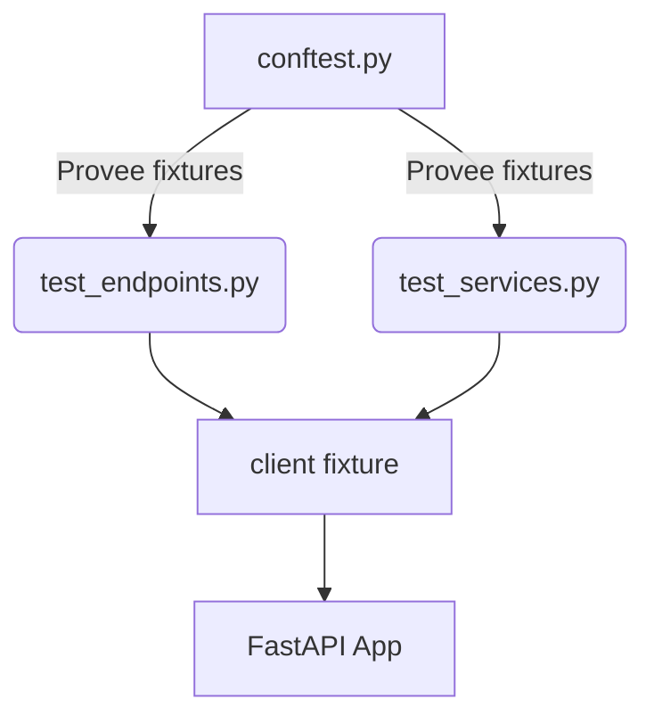

# tests/conftest.py

## Descripción General
Archivo de configuración compartida para pruebas pytest de Kelly API. Contiene fixtures reutilizables para tests unitarios e integración.

**Responsabilidad Principal:**  
Proveer configuraciones y clientes de prueba preconfigurados para:
- Pruebas de endpoints API
- Mockeo de dependencias externas
- Configuración común de tests

**Arquitectura:**  
Componente clave del sistema de testing que interactúa con:
- `pytest`: Framework de pruebas
- `httpx`: Cliente HTTP asíncrono
- `app.main`: Aplicación FastAPI bajo prueba

## Fixtures Principales

### `client()`
```python
@pytest_asyncio.fixture(scope="module")
async def client() -> Generator[AsyncClient, Any, None]:
```

**Propósito:**  
Cliente HTTP asíncrono preconfigurado para hacer requests a la API en memoria.

**Características:**
- Usa ASGITransport para comunicación directa con FastAPI
- Scope module: Se reutiliza entre tests del mismo módulo
- Manejo automático de conexiones con async context manager

**Ejemplo de Uso:**
```python
async def test_status_endpoint(client: AsyncClient):
    response = await client.get("/status")
    assert response.status_code == 200
```

## Dependencias Clave

### Internas
- `app.main:app`: Aplicación FastAPI bajo prueba

### Externas
- `pytest`: Framework de testing
- `pytest-asyncio`: Soporte para async/await
- `httpx`: Cliente HTTP asíncrono

## Configuración Requerida

| Paquete | Versión Mínima | Propósito |
|---------|----------------|-----------|
| pytest | 7.0+ | Framework de pruebas |
| pytest-asyncio | 0.20+ | Soporte para fixtures async |
| httpx | 0.24+ | Cliente HTTP asíncrono |

## Estructura Recomendada para Tests



## Buenas Prácticas

### Para Fixtures
1. Usar scope adecuado (module/session para recursos costosos)
2. Documentar side effects claramente
3. Limpiar recursos después de tests

### Para Tests
1. Reutilizar fixtures siempre que sea posible
2. No modificar estado global en tests
3. Usar marcadores para categorizar tests

## Ejemplo de Fixture Adicional

```python
@pytest.fixture
def mock_settings(monkeypatch):
    """Fixture para mockear variables de configuración"""
    monkeypatch.setattr(config, "API_KEY", "test-key")
    monkeypatch.setattr(config, "DEBUG", True)
```

## Consideraciones de Rendimiento
- Fixtures con scope module reducen tiempo de ejecución
- Evitar I/O real en fixtures de testing
- Mockear servicios externos cuando sea posible

## Posibles Mejoras
1. Fixture para base de datos de prueba
2. Fixtures para autenticación mock
3. Generación automática de datos de prueba